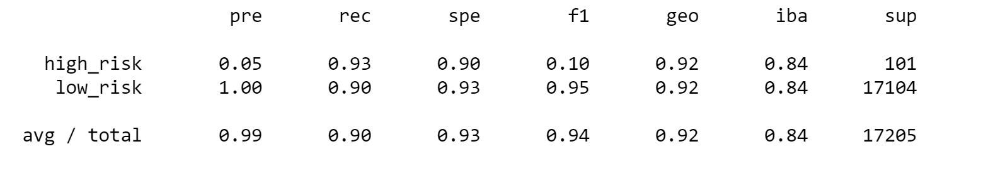

# Credit_Risk_Analysis

## Project Overview
We are analyzing data from LendingClub, a peer-to-peer lending services company, and creating a machine learning model that will predict an applicant’s credit risk.

### Purpose
The purpose of the model is to help streamline the application process for loans.  For the project we will employ different sampling techniques to account for unbalanced classes.  We will then test and compare a balanced random forest classifier and easy ensemble classifier, two models that reduce bias, and determine if either of the models can be used to consistently predict an applicant’s credit risk.

## Results
-	Naïve Random Oversampling logistic regression
    - Balanced accuracy score: 0.641
    -	Precision: 0.01
    -	Recall: 0.65

-	SMOTE oversampling logistic regression
    -	Balanced accuracy score: 0.663
    -	Precision: 0.01
    -	Recall: 0.63

- Cluster centroids undersampling logistic regression
  -	Balanced accuracy score: 0.545
  -	Precision: 0.01
  -	Recall: 0.69

-	SMOTEENN combination sampling logistic regression
    -	Balanced accuracy score: 0.648
    -	Precision: 0.01
    -	Recall: 0.71

-	Balanced Random Forest Classifier
    -	Balanced accuracy score: 0.789
    -	Precision: 0.03
    -	Recall: 0.70

-	Easy ensemble adaboost classifier
  	-	Balanced accuracy score: 0.915
    -	Precision: 0.05
    -	Recall: 0.93

## Summary
Of the six machine learning models we used, the easy ensemble classifier showed the best results.  It had the highest balanced accuracy score, precision, and recall. For a project like this, predicting an applicant’s credit risk, recall is more important than precision.  We want to know if an applicant is high risk, how likely our model is to classify them as such.  Because of this, I would recommend moving forward and implementing the easy ensemble classifier to assist with processing loan applications, as it’s recall and accuracy score are both high.
